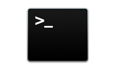

# Terminal---Mac-Guides



## 1) Basic Unix Commands

Terminal provides a command line interface to control the UNIX-based operating system. Here’s something important you need to know about Terminal, and what it can do for you.

### pwd

`pwd` is short for “print working directory”. It outputs the path of your current working directory. If you get lost, `pwd` can tell you where you are.

```
➜  ~ pwd
/Users/LyuZhanhe
```

### ls

The `ls` command outputs the names of all of the folders and files in the working directory. `ls` is short for “list” (as in “list” the contents).

Folder names end with a `/`, file names do not. Some terminals also add colorized output to `ls` to denote different types of files. For instance, Mimir’s terminal has folders in blue, and files in white.

```
➜  ~ ls
Applications             Music                    Public
Desktop                  PhpstormProjects         Downloads
Documents                Pictures                 iCloud Drive
```

`ls -l -R Desktop`: List all the files on the desktop. `-l`, `-R` are parameters, and also can be written as `-IR`. `-l` means including details like permissions, owner, file size. `-R`means including its subdirectories. You can find more parameters [here](http://www.rapidtables.com/code/linux/ls.htm).

`ls d**`: List all the files whose names begin with ‘d’.

### cd

The `cd` command is short for “change directory”. It allows you to change your working directory to some different folder.

`cd ../`: Go up one level.

```
➜  ~ cd Desktop
➜  Desktop cd ../
➜  ~
```

### mkdir

`mkdir [dir name]`: Create a new directory.

`mkdir -p dir_1/dir_2`: ‘p’ is short for parent. If dir_1 exists in your current working directory, create dir_2 in it. If not, create dir_1, then create dir_2 in it.

```
➜  Desktop mkdir test
➜  Desktop mkdir test/test1
➜  Desktop cd test
➜  test ls
test1
```

`mkdir -m 777 dir_3`: Create a directory named ‘dir_3’. It can be read, write and execute by any user.

`mkdir -m [xxx] dir_4`: The first digit represents the owner, the second represents the group and the third represents other users. The number 7 represents all three types of permission (i.e., read, write and execute), 6 stands for read and write only, 5 is read and execute, 4 is read only, 3 is write and execute, 2 is write only, 1 is execute only and 0 is no permission.

`mkdir -v dir_5`: Create a new directory. Also explain what it has done in the terminal, e.g. ‘mkdir: created directory ‘test3’’.

```
➜  test mkdir -m 343 test2
➜  test mkdir -v test3
mkdir: created directory 'test3'
```

### rm

`rm [file name]`: Delete a file. You will be asked to confirm the operation.

`rm -f [file name]`: Forcibly delete the file, the system no longer prompt.

`rm *.log`: Delete all .log files, delete one by one before asking to confirm.

```
➜  test ls
README.md  README1.md README2.md README3.md test1      test2      test3
➜  test rm README.md
➜  test ls
README1.md README2.md README3.md test1      test2      test3
➜  test rm -f README1.md
➜  test ls
README2.md README3.md test1      test2      test3
➜  test rm *.md
➜  test ls
test1 test2 test3
```

### rmdir

`rmdir [dirname]`: Remove directory (only operates on empty directories).

`rmdir -p [dirname]`: When the subdirectory is deleted so that its parent has become an empty directory, then also delete the parent.

```
➜  test rmdir test1
rmdir: test1: Directory not empty
➜  test rmdir test2
➜  test ls
test1 test3
➜  test rmdir -p test3/test4
➜  test ls
test1
```

### mv

`mv [file] [new filename]`: Rename a file.

`mv [file] [dirname]`: Move a source file to a directory.

`mv [file1] [file2] [dirname]`: Move a few files to a same directory.

```
➜  test ls -R
test1 test2

./test1:
README.md  README1.md README2.md

./test2:
➜  test cd test1
➜  test1 mv README.md README1.md README2.md ../test2
➜  test1 cd ../
➜  test ls -R
test1 test2

./test1:

./test2:
README.md  README1.md README2.md
```

`mv -i [file1] [file2]`: Rename file1 to file2. If file2 doesn’t exist, prompt before overwriting.

`mv -f [file1] [file2]`: Rename file1 to file2. Do not prompt before overwriting existing files. Please be careful when using it.

`mv [dir1] [dir2]`: Move dir1 to dir2. If dir2 doesn’t exist, rename dir1 to dir2.

`mv * ../`: Move all files under the current folder to the parent directory.

`mv [dir1]/* [dir2]`: Move the files in dir1 to dir2.

### cp

`cp [file] [dirname]`: Copy a single file to a target directory. If the file has been existed in the directory, you will be asked to confirm the replacement.

`cp -a [file] [dirname]`: The parameter `-a` 

### touch

`touch [file]`: Create a file.

`touch [file1] [file2]`: Create files.

`touch -t 201211234343.90 [file]`: Create a file and set its timestamp.

```
➜  ~ touch -t 201211234343.90 log1.log
➜  ~ ll *.log
-rw-r--r--  1 lyuZhanhe  staff     0B Nov 24  2012 log1.log
```

`touch -r [file1] [file2]`: Update the timestemp of file1 to the same as file2.

### cat

It is used to display the content of a file or link several files together or create new one. However, it cannot edit existing files.

`cat [file]`: Display the content of a file. If you specify more than one file name, `cat` will display those files one after the other.

```
➜  Desktop cat hello.md
hello world!%
```

`cat -n [file]`: Number all the output lines .

```
➜  Desktop cat -n h1.md
     1	line 1
     2	line 2
     3	lin3 3%                                                                 
```

`cat [file1] > [file2]`: Copy the content in `[file1]` to `[file2]`.

```
➜  Desktop cat h1.md > h2.md
```

`cat [file1] >> [file2]`: Append the content in `[file1]` to `[file2]`.

```
➜  Desktop cat h1.md >> h2.md
```

An example:

We use `cat` to catenate output text to the file's contents.

```
➜  Desktop echo "My Classes:" | cat - list.txt
My Classes:
math
biology
physics
```

### find

`find ~ -name "*.log" -print`: Find all the .log files in the root directory and print the result.

`find . -name "*.log" -print`: Find all the .log files in the current directory and print the result.

`find -atime -[n]`: Find all the files which have been accessed in n days.